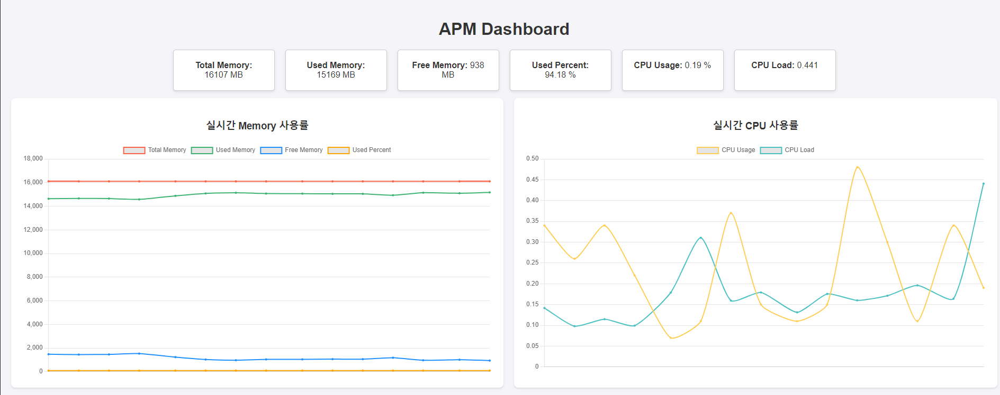
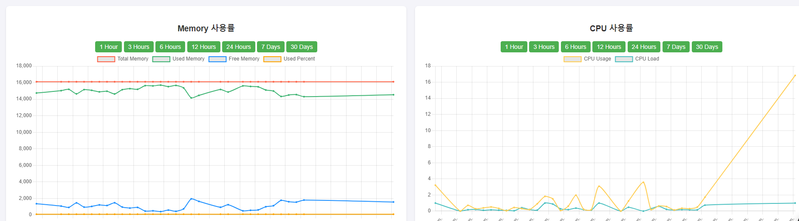

# APM 서버

## 개요


이 프로젝트는 Spring, WebSocket, JavaScript, Chart.js, InfluxDB를 사용하여 구현된 애플리케이션 성능 모니터링(APM) 서버입니다. 등록된
클라이언트의 CPU 및 메모리 사용량을 실시간 및 기간별로 모니터링할 수 있습니다.

## 기능

- **실시간 모니터링**: CPU 및 메모리 사용량을 실시간으로 추적합니다.
- **히스토리 데이터**: 지정된 기간 동안의 CPU 및 메모리 사용량을 조회합니다.
- **WebSocket 통합**: WebSocket을 사용하여 실시간 데이터 업데이트를 제공합니다.
- **인터랙티브 차트**: Chart.js를 사용하여 데이터를 시각화합니다.
- **InfluxDB**: 성능 메트릭을 저장하고 조회하기 위해 InfluxDB를 사용합니다.

## 기술 스택

- Java 17+
- Spring Boot 3.3.0
- InfluxDB latest

## 설치

1. **저장소 클론**:
    ```bash
   > git clone https://github.com/simgyuhwan/APM
   > cd task
    ```

2. **InfluxDB 설정**:
- Docker를 사용하여 InfluxDB를 시작합니다.
   ```base
   > docker-compose -f ./docker-compose.yml up
   ```
- InfluxDB를 시작하고 메트릭을 저장할 데이터베이스를 생성합니다.

3. **애플리케이션 구성**:
- `application.yaml` 파일을 업데이트하여 InfluxDB 연결 정보를 입력합니다.
   ```yaml
   influxdb:
    url: http://localhost:8086
    username: admin
    password: Password!
    org: apm-org
    bucket: apm-bucket
    token: {token-value} 
   ```

4. **서버 빌드 및 실행**:
    ```bash
    > gradle clean build
    ```

5. **클라이언트 시작**:
    ```bash
    > java -jar /build/libs/task-0.0.1-SNAPSHOT.jar
    ```

## 사용법

- **대시보드 접근**: 브라우저를 열고 `http://localhost:9898`으로 이동합니다.

[//]: # (- **클라이언트 등록**: 제공된 API를 사용하여 대시보드에 클라이언트 서버를 등록합니다.)
- **메트릭 모니터링**: 대시보드에서 실시간 및 히스토리 CPU 및 메모리 사용량을 확인합니다.
  - 실시간 metrics 수집 기간 수정 방법(application.yml)
    - metrics.scheduling.fixed-delay = 5000 (ms)
   
   

